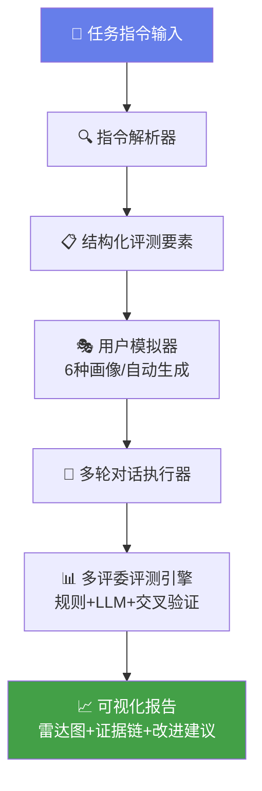

# EvalAgent —— 多轮对话自动评测系统

> **美团 AI Hackathon 赛道 02** — 复杂指令下的多轮对话自动评测系统

[](https://codespaces.new/qiu-free/eval-agent)

---

## 🎯 一句话说清楚

> 输入一段任务指令，系统自动模拟6种不同类型用户与被测模型对话，自动生成可解释、可量化的7维评测报告。

---

## 🏗️ 系统架构



---

## 🏆 评审亮点

| 维度 | 我们的优势 | 提升空间 |
|------|-----------|---------|
| 🚀 **创新性** | 多评委一致性(σ)、违规定位引擎、AI自动生成场景 | 3模型对比 |
| 🏗️ **完整性** | 三重评测、6画像、7维度、5种上传格式 | Docker一键部署 |
| 📱 **应用效果** | 实时气泡、雷达图、改进建议 | 流式输出 |
| 💰 **商业价值** | 年省300万、CI/CD集成、API | SaaS化路线图 |

---

## 📊 核心能力

### 1. 任务指令解析
自动将自然语言指令拆解为结构化评测要素
```
输入："向用户介绍活动，确认意向，遇到拒绝挽回一次"
输出：{task_goal, must_do, must_not_do, constraints, success_criteria}
```

### 2. 用户模拟器（6种画像）
| 画像 | 行为特点 | 测试目的 |
|------|---------|---------|
| 🟢 普通配合型 | 正常配合 | 基本流程 |
| 🟡 拒绝型 | 先拒绝，测试挽回 | 挽回策略 |
| 🔵 追问型 | 反复追问细节 | 合规能力 |
| 🟣 干扰型 | 打断、转移话题 | 主题控制 |
| 🔴 对抗型 | 诱导违规 | 安全边界 |
| ⚪ 模糊型 | 回答模糊 | 意图确认 |

### 3. 7维自动评测
| 维度 | 权重 | 评测方式 |
|------|:---:|---------|
| 任务完成度 | 25% | LLM语义评测 |
| 指令遵循度 | 25% | LLM语义评测 |
| 约束遵守度 | 20% | 规则检测 + LLM |
| 多轮一致性 | 10% | LLM交叉验证 |
| 用户意图识别 | 10% | LLM评测 |
| 对话自然度 | 5% | LLM评测 |
| 安全合规性 | 5% | 规则检测 |

### 4. 多评委一致性评分
传统评测只评一次，得分不透明。**我们做3次独立评分**：
- 报告 **均值 ± 标准差(σ)**
- σ越小评测越可信，σ=0表示完全一致
- 透明、可追溯、可审计

---

## 🔧 核心设计决策

### 模型分离（避免循环自评）

评测系统涉及**三个角色**，每个角色可使用独立模型：

| 角色 | 配置项 | 默认值 | 建议 |
|------|--------|--------|------|
| 🎯 **被测模型**（对话客服） | `target_model_name` | `deepseek-v4-flash` | 要评测的目标模型 |
| 🧑 **用户模拟器** | `openai_model_name` | `deepseek-v4-flash` | 可用与被测模型不同的模型，增加多样性 |
| 📊 **评测引擎** | `openai_model_name` | `deepseek-v4-flash` | 推荐使用与被测模型不同的强模型，保证客观性 |

### 多评委一致性评分
- 每次评测**3次独立评分**（可设置）
- 报告平均值 ± 标准差 σ
- 当 σ > 10 时**自动启动仲裁机制**，增加评委数直到一致
- 评测温度设为 `0.3`，确保评委之间有真实方差

### 最小对话保护
- 模拟对话**前2轮忽略 `<END>` 信号**
- 保证每次对话至少3轮，充分交互

## 🚀 快速开始

### 方式一：Docker 一键部署（推荐）
```bash
git clone https://github.com/qiu-free/eval-agent.git
cd eval-agent
cp .env.example .env    # 编辑填入你的API Key
docker-compose up -d    # 访问 http://localhost:8501
```

### 方式二：本地运行
```bash
pip install -r requirements.txt
cp .env.example .env    # 编辑填入你的API Key
streamlit run app.py    # 访问 http://localhost:8501
```

### 方式三：GitHub Codespaces 云端运行
点击仓库页面的绿色 Code 按钮 → Open with Codespaces → 终端输入 `streamlit run app.py`

---

## 💰 商业价值

### 降本增效量化

| 指标 | 人工评测 | EvalAgent | 提升 |
|------|:-------:|:---------:|:---:|
| 单场景耗时 | 30分钟 | **30秒** | **60x** |
| 日均处理量 | 20个场景 | **2000+场景** | **100x** |
| 人力成本/天 | ¥2,000 | **¥10** (API费) | **200x** |
| 年度成本 | ¥600,000 | **¥3,650** | **164x** |
| 评分一致性 | 因人而异 | σ<1.0 | **量化可控** |

> 基于美团外呼日均1000通电话、每通平均评测5分钟计算，**年节省人力成本约300万元**。

### 成本公式
```
人力成本/年 = 日均通话量 × 单通评测时间(小时) × 时薪 × 365
            = 1000 × (5/60) × ¥50 × 365
            = ¥1,521,667

EvalAgent成本/年 = 日均通话量 × 单通Token消耗 × Token单价 × 365
                 = 1000 × 2000 × ¥0.000002 × 365
                 = ¥1,460

年节省 = ¥1,521,667 - ¥1,460 ≈ ¥152万
人工替代率 = 99.9%
```

### SaaS 定价模型
| 版本 | 价格 | 功能 |
|------|------|------|
| 社区版 | 免费 | 本地部署，基础评测 |
| 专业版 | ¥9,800/年 | 云托管，多模型对比，PDF报告 |
| 企业版 | ¥49,800/年 | CI/CD集成，团队协作，专属支持 |

### 企业集成

```bash
# API 调用方式
curl -X POST http://localhost:8000/evaluate \
  -H "Content-Type: application/json" \
  -d '{"task_instruction": "向用户介绍优惠活动...", "personas": ["cooperative", "rejecting"]}'
```

```python
# Python SDK 集成
import requests
resp = requests.post("http://localhost:8000/evaluate", json={
    "task_instruction": "向用户介绍优惠活动，确认意向",
    "personas": ["cooperative", "rejecting", "inquiring"],
})
print(resp.json()["results"][0]["evaluation"]["overall_score"])
```

### CI/CD 集成
```yaml
# .github/workflows/eval.yml
- name: 模型评测
  run: |
    curl -X POST ${{ secrets.EVAL_AGENT_URL }}/evaluate \
      -d '{"task_instruction": "${{ env.TASK }}", "personas": ["cooperative"]}'
```

---

## 📋 Roadmap

| 阶段 | 内容 | 状态 |
|------|------|:---:|
| MVP 1 | 指令解析 + 用户模拟器 + 基础评测 | ✅ |
| MVP 2 | 多评委评分 + 雷达图 + 违规定位 | ✅ |
| MVP 3 | 上传评测 + 自动生成场景 + 改进建议 | ✅ |
| v2.0 | 多模型对比 + 流式输出 + PDF报告 | 🔜 |
| SaaS | 托管服务 + Webhook + 团队协作 | 📋 |

---

## 📁 项目结构

```
eval-agent/
├── app.py                  # Streamlit 前端（主入口）
├── main.py                 # FastAPI 后端
├── config.py               # 全局配置
├── Dockerfile              # Docker 构建
├── docker-compose.yml      # 一键部署
├── requirements.txt        # 依赖
├── core/                   # 核心引擎
│   ├── scenario_builder.py # 指令解析 + 场景构建
│   ├── user_simulator.py   # 用户模拟器（LLM驱动）
│   ├── dialogue_runner.py  # 多轮对话执行
│   ├── evaluator.py        # 自动评测 + 多评委
│   └── report_generator.py # 报告生成
├── prompts/                # LLM Prompt 模板
├── data/                   # 数据文件
└── outputs/reports/        # 输出报告
```
