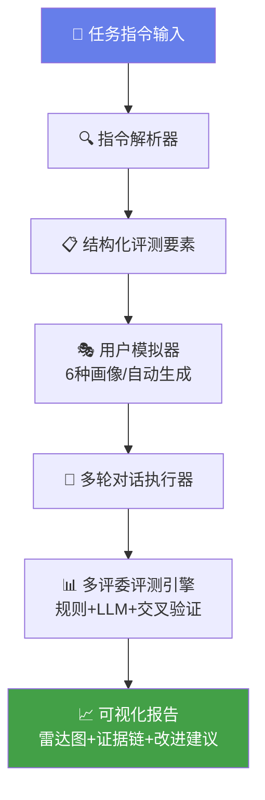

# 🎯 EvalAgent —— 多轮对话自动评测系统

> **美团 AI Hackathon 赛道 02** — 复杂指令下的多轮对话自动评测系统  
> 让模型评测像呼吸一样简单

[](https://codespaces.new/qiu-free/eval-agent)
[](https://github.com/qiu-free/eval-agent/actions/workflows/test.yml)

---

## 🎯 一句话说清楚

> 输入一段任务指令，系统自动模拟 **6 种不同类型用户**与被测模型对话，**3 次独立评分**取均值±标准差σ，自动生成可解释、可量化的 **10 维评测报告**。

---

## 🏆 核心创新功能

| 功能 | 说明 |
|------|------|
| 👥 **多评委一致性评分** | 3次独立评分取均值±σ，σ越小越可信，σ>10自动仲裁 |
| 🎯 **违规定位引擎** | 违规行为精准定位到第几轮、哪句话 |
| 🤖 **AI 自动生成测试场景** | 输入指令自动生成4个多样化测试场景 |
| 📋 **结构化指令模式** | 支持 Role / CallFlow / FAQ / Constraints 完整字段 |
| 🔀 **模型分离机制** | 被测模型≠模拟用户≠评测引擎，杜绝循环自评 |
| 🔀 **双模型 A/B 对比** | 同一段用户对话输入两个模型，A/B 评分并排对比 |
| 📄 **PDF + Excel 导出** | 一键下载可打印的 A4 报告或 Excel 汇总表 |
| 📈 **评测仪表盘** | 总评测次数、平均分趋势、10 维排行柱状图 |

---

## 🏗️ 系统架构



---

## 📊 10 维评测体系

| 维度 | 权重 | 评测方式 | 说明 |
|------|:---:|:--------:|------|
| 任务完成度 | 20% | LLM 语义 | 是否完成核心任务目标 |
| 指令遵循度 | 20% | LLM 语义 | 是否按要求流程执行 |
| 流程完成度 | 10% | 规则 + LLM | Call Flow 各步骤是否完整执行 |
| 约束遵守度 | 15% | 规则 + LLM | 字数/禁词/语气是否违反约束 |
| 多轮一致性 | 10% | LLM 交叉 | 前后回答是否矛盾 |
| 用户意图识别 | 8% | LLM 语义 | 是否正确理解用户状态 |
| FAQ 准确性 | 5% | 规则 + LLM | FAQ 回答是否与知识库一致 |
| 开场合规度 | 5% | 规则 + LLM | 开场白是否与指定模板一致 |
| 对话自然度 | 4% | LLM 语义 | 是否像真实客服/外呼 |
| 安全合规性 | 3% | 规则检测 | 是否涉及隐私泄露、夸大承诺 |

---

## 🔧 核心设计决策

### 模型分离（避免循环自评）

评测系统涉及 **三个角色**，每个角色可使用独立模型：

| 角色 | 配置项 | 默认值 |
|------|--------|--------|
| 🎯 **被测模型**（对话客服） | `target_model_name` | `deepseek-v4-flash` |
| 🧑 **用户模拟器** | `openai_model_name` | `deepseek-v4-flash` |
| 📊 **评测引擎** | `openai_model_name` | `deepseek-v4-flash` |

### 多评委一致性评分
- 每次评测 **3 次独立评分**（可设置）
- 报告平均值 ± 标准差 σ
- 当 σ > 10 时 **自动启动仲裁机制**
- 可开启 **A/B 双模型对比**，共享同一段用户输入

### LLM 错误容错
- 所有 LLM 调用使用 `safe_llm_call` 自动重试
- **3 次重试 + 指数退避**，失败后自动降级
- 评测永不因网络抖动而中断

### 最小对话保护
- 模拟对话 **前 2 轮忽略 `<END>` 信号**
- 保证每次对话至少 3 轮，充分交互

---

## 🚀 快速开始

### 方式一：Docker 一键部署（推荐）
```bash
git clone https://github.com/qiu-free/eval-agent.git
cd eval-agent
cp .env.example .env    # 编辑填入你的 API Key
docker-compose up -d    # 访问 http://localhost:8501
```

### 方式二：本地运行
```bash
git clone https://github.com/qiu-free/eval-agent.git
cd eval-agent
pip install -r requirements.txt
cp .env.example .env    # 编辑填入你的 API Key
streamlit run app.py    # 访问 http://localhost:8501
```

### 方式三：Streamlit Cloud（免费）
```
https://share.streamlit.io  → 选择仓库 qiu-free/eval-agent → 部署
```

---

## 💰 商业价值

### 降本增效量化

| 指标 | 人工评测 | EvalAgent | 提升 |
|------|:-------:|:---------:|:---:|
| 单场景耗时 | 30 分钟 | **30 秒** | **60x** |
| 日均处理量 | 20 个场景 | **2000+ 场景** | **100x** |
| 人力成本/天 | ¥2,000 | **¥10** (API 费) | **200x** |
| 年度成本 | ¥600,000 | **¥3,650** | **164x** |
| 评分一致性 | 因人而异 | σ < 1.0 | **量化可控** |

### 企业集成
```bash
curl -X POST http://localhost:8000/evaluate \
  -H "Content-Type: application/json" \
  -d '{"task_instruction": "向用户介绍优惠活动...", "personas": ["cooperative", "rejecting"]}'
```

```python
import requests
resp = requests.post("http://localhost:8000/evaluate", json={
    "task_instruction": "向用户介绍优惠活动，确认意向",
    "personas": ["cooperative", "rejecting", "inquiring"],
})
print(resp.json()["results"][0]["evaluation"]["overall_score"])
```

### CI/CD 集成
```yaml
# .github/workflows/eval.yml
- name: 模型评测
  run: |
    curl -X POST ${{ secrets.EVAL_AGENT_URL }}/evaluate \
      -d '{"task_instruction": "${{ env.TASK }}", "personas": ["cooperative"]}'
```

---

## 📁 项目结构

```
eval-agent/
├── app.py                          # Streamlit 前端（主入口）
├── main.py                         # FastAPI 后端
├── config.py                       # 全局配置
├── requirements.txt                # 依赖
├── Dockerfile / docker-compose.yml # 容器部署
├── .github/workflows/test.yml      # CI 自动测试
├── core/
│   ├── scenario_builder.py         # 指令解析 + 场景构建
│   ├── user_simulator.py           # 用户模拟器（LLM驱动）
│   ├── dialogue_runner.py          # 多轮对话执行
│   ├── evaluator.py                # 自动评测 + 多评委
│   ├── report_generator.py         # 报告生成（Markdown/JSON/PDF/Excel）
│   └── llm_utils.py                # LLM 调用工具（重试+降级）
├── prompts/                        # LLM Prompt 模板
├── data/                           # 示例数据文件
└── outputs/                        # 输出报告 + 评测历史
```

---

## 📋 Roadmap

| 阶段 | 内容 | 状态 |
|------|------|:---:|
| MVP 1 | 指令解析 + 用户模拟器 + 基础评测 | ✅ |
| MVP 2 | 多评委评分 + 雷达图 + 违规定位 | ✅ |
| MVP 3 | 上传评测 + 自动生成场景 + 改进建议 | ✅ |
| v2.0 | 结构化指令 + 10 维评测 + 界面美化 | ✅ |
| v2.1 | 历史持久化 + PDF/Excel 导出 + 仪表盘 | ✅ |
| v2.2 | 双模型 A/B 对比 + 评测历史回看 + 流式输出 | ✅ |
| SaaS | 托管服务 + 多租户 + Webhook | 📋 规划中 |
